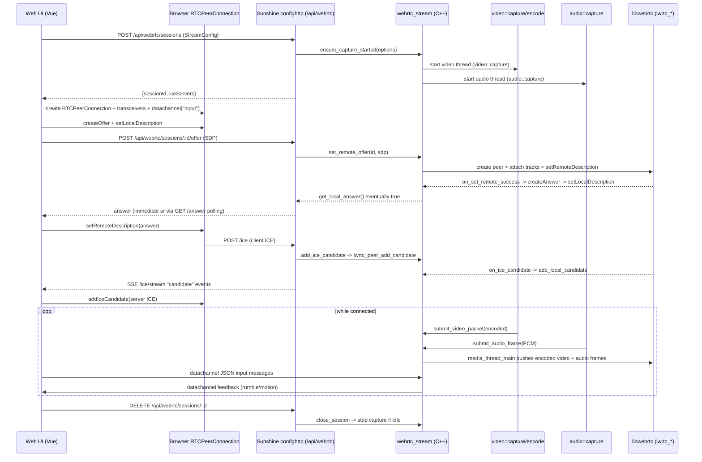

# Sunshine Architecture (with WebRTC deep dive)

This document describes Sunshine’s runtime architecture (processes/threads/modules) and gives an end-to-end, code-level walk-through of how the **experimental WebRTC streaming path** is established and how media/input flows from capture -> encode -> WebRTC transport -> browser playback.

Repo snapshot: this documentation was written against the code currently in this workspace; file references below are the source of truth.

---

## 1) Big picture

Sunshine is a single host-side daemon (one process) that:

- Enumerates/launches the configured “apps” to stream (`src/process.cpp`).
- Captures video frames from the host display (`src/video.cpp` + `src/platform/**`).
- Captures audio samples (`src/audio.cpp` + `src/platform/**`).
- Injects input events (mouse/keyboard/gamepad/touch) into the host (`src/input.cpp` + `moonlight-common-c` packet formats).
- Exposes multiple “front doors”:
  - The legacy Moonlight/GameStream-compatible stack (`src/nvhttp.cpp`, `src/stream.cpp`, `src/rtsp.cpp`).
  - The built-in HTTPS Web UI + REST API (`src/confighttp.cpp`) which also hosts the **WebRTC** experimental client and signaling API.

At runtime, Sunshine is fundamentally a set of long-lived service threads (HTTP servers, discovery) plus per-stream capture/encode threads. Cross-thread coordination is done primarily via a shared “mailbox” abstraction (`safe::mail_raw_t`, created in `src/main.cpp`) and per-stream mailboxes.

---

## 2) Repository layout (what lives where)

### Core daemon (C++)

- `src/main.cpp`: process entrypoint; initializes subsystems; starts server threads.
- `src/confighttp.cpp`: HTTPS server for the Web UI + REST API, including `/api/webrtc/**`.
- `src/nvhttp.cpp`: NVIDIA GameStream-compatible HTTP control plane.
- `src/stream.cpp`, `src/rtsp.cpp`: session management and media/control plane for the “classic” streaming stack.
- `src/video.cpp`: display capture, colorspace, encode (NVENC/FFmpeg/…); produces encoded packets.
- `src/audio.cpp`: audio capture and (for non-WebRTC paths) Opus encode; produces PCM and/or encoded packets.
- `src/input.cpp`: input injection and gamepad handling; consumes Moonlight-format input packets.
- `src/webrtc_stream.cpp`, `src/webrtc_stream.h`: WebRTC session tracking, signaling integration, media handoff into libwebrtc, and WebRTC data-channel input.

### Platform backends (capture + input + helpers)

- `src/platform/**`: OS-specific code (Windows, Linux, macOS) for capture, audio, virtual display, display helper, etc.
  - Windows-specific display management used by WebRTC: `src/platform/windows/display_helper_integration.*`, `src/platform/windows/virtual_display.*`.

### Web UI (Vue + TS)

- `src_assets/common/assets/web/views/WebRtcClientView.vue`: the experimental WebRTC client page (`/webrtc`).
- `src_assets/common/assets/web/utils/webrtc/client.ts`: browser-side WebRTC session orchestration (`RTCPeerConnection`, ICE, stats).
- `src_assets/common/assets/web/utils/webrtc/input.ts`: input capture (mouse/keyboard/gamepad) -> JSON messages -> WebRTC data channel.
- `src_assets/common/assets/web/services/webrtcApi.ts`: HTTP signaling client (`/api/webrtc/sessions/**` + ICE SSE fallback).
- `src_assets/common/assets/web/types/webrtc.ts`: wire types for WebRTC config, session state, and input payloads.

### WebRTC dependency

- `SUNSHINE_ENABLE_WEBRTC=ON` links against a separately built `libwebrtc` wrapper (see `docs/building.md` and `cmake/dependencies/webrtc.cmake`).
- C++ integration uses a C API surface: `#include <libwebrtc_c.h>` in `src/webrtc_stream.cpp`.

---

## 3) Runtime process and thread model

### Global bootstrap

The main entry (`src/main.cpp`) performs:

1. Configuration parse (`config::parse`).
2. Logging setup.
3. Platform initialization (`platf::init()`), process/app manager init (`proc::init()`), input init (`input::init()`), encoder probe (`video::probe_encoders()`).
4. HTTP stack initialization (`http::init()`).
5. Starts long-lived service threads:
   - `std::thread httpThread {nvhttp::start};` (GameStream HTTP control)
   - `std::thread configThread {confighttp::start};` (Web UI + REST + WebRTC signaling)
   - `std::thread rtspThread {rtsp_stream::start};` (classic streaming media/control plane)

### Mailbox-based coordination

`src/main.cpp` creates a global mailbox:

```cpp
// src/main.cpp
mail::man = std::make_shared<safe::mail_raw_t>();
auto shutdown_event = mail::man->event<bool>(mail::shutdown);
```

Per-session pipelines create their own `safe::mail_raw_t` instances and use typed events/queues to coordinate (shutdown, IDR request, gamepad feedback, etc). WebRTC capture uses a dedicated mailbox stored in `webrtc_capture.mail` (see `src/webrtc_stream.cpp`).

### Mutual exclusion between classic streaming and WebRTC

WebRTC capture refuses to start if a classic streaming session is active:

```cpp
// src/webrtc_stream.cpp
if (rtsp_sessions_active.load(std::memory_order_relaxed)) {
  return std::string {"RTSP session already active"};
}
```

Classic sessions toggle this flag:

```cpp
// src/stream.cpp
webrtc_stream::set_rtsp_sessions_active(true);   // on first session start
webrtc_stream::set_rtsp_sessions_active(false);  // when last session ends
```

This is a key architectural constraint: **Sunshine runs either RTSP/GameStream streaming or WebRTC streaming, not both concurrently** (in the current implementation).

---

## 4) Web UI + API server (confighttp)

`confighttp::start()` (`src/confighttp.cpp`) creates a TLS HTTPS server using the configured cert/key:

```cpp
// src/confighttp.cpp
https_server_t server(config::nvhttp.cert, config::nvhttp.pkey);
server.config.port = net::map_port(PORT_HTTPS);
```

It registers the SPA entry handler for GET routes, plus a large REST API surface under `/api/**`. The WebRTC signaling endpoints are registered here:

```cpp
// src/confighttp.cpp
server.resource["^/api/webrtc/sessions$"]["POST"] = createWebRTCSession;
server.resource["^/api/webrtc/sessions/([A-Fa-f0-9-]+)/offer$"]["POST"] = postWebRTCOffer;
server.resource["^/api/webrtc/sessions/([A-Fa-f0-9-]+)/ice$"]["POST"] = postWebRTCIce;
server.resource["^/api/webrtc/sessions/([A-Fa-f0-9-]+)/ice/stream$"]["GET"] = getWebRTCIceStream;
// ...and GET/DELETE/list/answer/cert endpoints
```

### Authentication

Every WebRTC endpoint uses `authenticate()` (`src/confighttp.cpp`) which ultimately checks:

- `Authorization:` header (e.g., API token)
- Or an HttpOnly session cookie token (`extract_session_token_from_cookie`)

This matters because the WebRTC signaling is “just another authenticated API surface”; it is not a separate unauthenticated signaling server.

---

## 5) WebRTC streaming end-to-end (start -> running -> stop)

This section is the complete WebRTC pipeline, from the Web UI button click all the way to encoded frames being pushed into libwebrtc and rendered in the browser.

### 5.1 Browser/UI entrypoint

The WebRTC client UI is a Vue route (`/webrtc`) declared in `src_assets/common/assets/web/router.ts`, rendering `src_assets/common/assets/web/views/WebRtcClientView.vue`.

On connect, the view constructs a `WebRtcClient` (browser-side orchestrator) and calls `client.connect(config, callbacks)`:

```ts
// src_assets/common/assets/web/views/WebRtcClientView.vue
const id = await client.connect({
  ...config,
  appId: selectedAppId.value ?? undefined,
  resume: selectedAppId.value ? false : resumeOnConnect.value,
}, {
  onRemoteStream: (stream) => { videoEl.value!.srcObject = stream; void videoEl.value!.play(); },
  onInputMessage: (message) => applyGamepadFeedback(message),
});
```

Key things to note:

- The UI passes an `appId` when the user selects a game; otherwise it can request a “resume” session.
- The remote audio/video are played as a normal browser `MediaStream`.
- Input capture is enabled by attaching listeners to a DOM element and sending JSON payloads to the data channel (details below).

### 5.2 Signaling API: create session (HTTP)

The browser first creates a server-side session using `POST /api/webrtc/sessions` implemented in `createWebRTCSession()` (`src/confighttp.cpp`).

#### Browser request payload

The Web UI uses `WebRtcHttpApi.createSession()` (`src_assets/common/assets/web/services/webrtcApi.ts`), which sends:

```ts
// src_assets/common/assets/web/services/webrtcApi.ts
const payload = {
  audio: true,
  host_audio: !muteHostAudio,
  video: true,
  encoded: true,
  width, height, fps,
  bitrate_kbps: bitrateKbps,
  codec: encoding,           // 'h264' | 'hevc' | 'av1'
  hdr,
  audio_channels: audioChannels,
  audio_codec: audioCodec,   // validated server-side (currently capture bypasses Opus)
  profile,
  app_id: appId,
  resume,
  video_pacing_mode,
  video_pacing_slack_ms,
  video_max_frame_age_ms,
};
await http.post('/api/webrtc/sessions', payload);
```

#### Server-side handling

`createWebRTCSession()` does 3 critical things:

1. Validates and normalizes options (codec, audio channels, pacing bounds, etc.).
2. Starts capture/encode threads (if not already running) via `webrtc_stream::ensure_capture_started(options)`.
3. Creates a lightweight session record via `webrtc_stream::create_session(options)`.

```cpp
// src/confighttp.cpp
if (auto error = webrtc_stream::ensure_capture_started(options)) {
  bad_request(response, request, error->c_str());
  return;
}
auto session = webrtc_stream::create_session(options);
output["session"] = webrtc_session_to_json(session);
output["ice_servers"] = load_webrtc_ice_servers();
```

The response includes:

- `session.id` (used as the URL path key everywhere else)
- `ice_servers`: parsed from env var `SUNSHINE_WEBRTC_ICE_SERVERS` (see below)
- `cert_fingerprint` / `cert_pem`: from `webrtc_stream::get_server_cert_*()` (server TLS cert info; useful for debugging/pinning)

### 5.3 Capture/encode start (server-side)

`ensure_capture_started()` simply delegates to `start_webrtc_capture()` (`src/webrtc_stream.cpp`). This is where WebRTC streaming “actually starts” on the host.

#### Preconditions

`start_webrtc_capture()` enforces:

- No classic session active (`rtsp_sessions_active` check).
- A running app exists to “resume”, or an `app_id` is provided to launch.

#### Launch + display prep (Windows-specific heavy lifting)

If an app must be launched, it uses the same process infrastructure as classic sessions (`proc::proc.execute(...)`). It also prepares the display environment (virtual display, display helper integration) before capture:

```cpp
// src/webrtc_stream.cpp
prepare_virtual_display_for_webrtc_session(launch_session);
auto request = display_helper_integration::helpers::build_request_from_session(config::video, *launch_session);
if (request) {
  display_helper_integration::apply(*request);
}
const auto verification_status = display_helper_integration::wait_for_apply_verification(6000ms);
if (verification_status == ApplyVerificationStatus::Failed) {
  return std::string {"Display helper validation failed; refusing to start capture."};
}
```

#### Encoder availability

Capture only starts if encoders can be initialized:

```cpp
// src/webrtc_stream.cpp
if (video::probe_encoders()) {
  return std::string {"Failed to initialize video capture/encoding. Is a display connected and turned on?"};
}
```

#### Threads created for WebRTC capture

WebRTC capture uses its own mailbox and dedicated threads:

```cpp
// src/webrtc_stream.cpp
webrtc_capture.mail = std::make_shared<safe::mail_raw_t>();
webrtc_capture.feedback_queue = mail->queue<platf::gamepad_feedback_msg_t>(mail::gamepad_feedback);
webrtc_capture.feedback_thread = std::thread([queue]{ feedback_thread_main(queue); });

webrtc_capture.video_thread = std::thread([mail, video_config] { video::capture(mail, video_config, nullptr); });
webrtc_capture.audio_thread = std::thread([mail, audio_config] { audio::capture(mail, audio_config, nullptr); });
webrtc_capture.active = true;
```

Important configuration details for WebRTC capture:

- `build_video_config()` selects resolution/fps/bitrate and maps the requested codec to Sunshine’s internal `videoFormat` (`src/webrtc_stream.cpp`).
- `build_audio_config()` sets `bypass_opus = true`, meaning the audio thread will deliver raw PCM frames (WebRTC does its own audio encoding):

```cpp
// src/webrtc_stream.cpp
audio::config_t config {};
config.bypass_opus = true;
config.flags[audio::config_t::HOST_AUDIO] = options.host_audio;
```

### 5.4 Browser-side PeerConnection setup

Once the HTTP session exists, the browser creates a `RTCPeerConnection` and prepares for **receive-only** audio/video.

Key setup from `WebRtcClient.connect()` (`src_assets/common/assets/web/utils/webrtc/client.ts`):

```ts
this.pc = new RTCPeerConnection({
  iceServers: session.iceServers,
  bundlePolicy: 'max-bundle',
  rtcpMuxPolicy: 'require',
});

const videoTransceiver = this.pc.addTransceiver('video', { direction: 'recvonly' });
this.pc.addTransceiver('audio', { direction: 'recvonly' });
applyCodecPreferences(videoTransceiver, sessionConfig.encoding);

this.inputChannel = this.pc.createDataChannel('input', { ordered: false, maxRetransmits: 0 });
```

Notes:

- The client explicitly sets codec preferences (including a special preference for H.264 `packetization-mode=1`).
- The “input” data channel is **unreliable** (`ordered:false`, `maxRetransmits:0`) to minimize latency.

### 5.5 Signaling: offer -> answer (HTTP + async server callbacks)

#### Offer creation

The browser creates an offer, optionally “munges” it to include bitrate hints, then posts it:

```ts
// src_assets/common/assets/web/utils/webrtc/client.ts
const offer = await this.pc.createOffer({ offerToReceiveAudio: true, offerToReceiveVideo: true });
const mungedOffer = { type: offer.type, sdp: applyInitialBitrateHints(offer.sdp ?? '', bitrateKbps) };
await this.pc.setLocalDescription(mungedOffer);
const answer = await this.api.sendOffer(sessionId, { type: mungedOffer.type, sdp: mungedOffer.sdp ?? '' });
await this.pc.setRemoteDescription(answer);
```

#### Server: accept offer, create peer, attach tracks, set remote description

The server endpoint `POST /api/webrtc/sessions/:id/offer` calls:

```cpp
// src/confighttp.cpp
webrtc_stream::set_remote_offer(session_id, sdp, type);
```

`webrtc_stream::set_remote_offer()` (`src/webrtc_stream.cpp`) does the heavy lifting:

1. Stores the SDP offer in the session state (`has_remote_offer = true`).
2. Creates the WebRTC peer connection if needed (`create_peer_connection()`).
3. Registers the data channel handler (`lwrtc_peer_register_data_channel`).
4. Attaches media tracks (`attach_media_tracks(session)`).
5. Calls `lwrtc_peer_set_remote_description(...)` with async callbacks.

Snippet (simplified to show control flow):

```cpp
// src/webrtc_stream.cpp
if (!it->second.peer) {
  it->second.peer = create_peer_connection(it->second.state, it->second.ice_context.get());
}
lwrtc_peer_register_data_channel(it->second.peer, &on_data_channel, it->second.data_channel_context.get());
attach_media_tracks(it->second);

lwrtc_peer_set_remote_description(peer, sdp.c_str(), type.c_str(),
  &on_set_remote_success, &on_set_remote_failure, new SessionPeerContext{session_id, peer});
```

#### Answer generation (async)

The answer is produced asynchronously by libwebrtc callbacks:

- `on_set_remote_success()` triggers `lwrtc_peer_create_answer(...)`.
- `on_create_answer_success()` triggers `lwrtc_peer_set_local_description(...)`.
- `on_set_local_success()` stores the SDP/type in the Sunshine session:

```cpp
// src/webrtc_stream.cpp
void on_set_local_success(void *user) {
  auto *ctx = static_cast<LocalDescriptionContext *>(user);
  set_local_answer(ctx->session_id, ctx->sdp, ctx->type);
  delete ctx;
}
```

Because answer creation is async, `POST /offer` blocks briefly to wait for the answer (to avoid an extra RTT in the common case). If it times out, it returns `answer_ready=false` and the browser falls back to polling `GET /api/webrtc/sessions/:id/answer` (see `waitForAnswer()` in `webrtcApi.ts`).

### 5.6 ICE candidate exchange (HTTP POST + SSE/poll GET)

#### Client -> server ICE candidates

The browser batches ICE candidates for a short window (to reduce HTTPS churn), then uploads them:

```ts
// src_assets/common/assets/web/utils/webrtc/client.ts
this.pc.onicecandidate = (event) => {
  if (!event.candidate) return;
  queueCandidate(event.candidate.toJSON());
  // flush (e.g. every 75ms) via:
  // void this.api.sendIceCandidates(sessionId, queuedCandidates);
};
```

Server endpoint `POST /api/webrtc/sessions/:id/ice` accepts either a single `{sdpMid,sdpMLineIndex,candidate}` object or `{candidates:[...]}`, then calls:

```cpp
// src/confighttp.cpp
webrtc_stream::add_ice_candidate(session_id, std::move(mid), mline_index, std::move(candidate));
```

If the peer exists, `webrtc_stream::add_ice_candidate()` forwards it into libwebrtc:

```cpp
// src/webrtc_stream.cpp
if (peer && !stored_candidate.empty()) {
  lwrtc_peer_add_candidate(peer, stored_mid.c_str(), stored_mline_index, stored_candidate.c_str());
}
```

#### Server -> client ICE candidates

libwebrtc produces local candidates via `on_ice_candidate(...)`, which stores them in a per-session list:

```cpp
// src/webrtc_stream.cpp
void on_ice_candidate(void *user, const char *mid, int mline_index, const char *candidate) {
  add_local_candidate(ctx->id, std::string{mid}, mline_index, std::string{candidate});
}
```

The browser subscribes to remote candidates using:

- **Preferred**: Server-Sent Events `GET /api/webrtc/sessions/:id/ice/stream?since=N`
- **Fallback**: polling `GET /api/webrtc/sessions/:id/ice?since=N`

```ts
// src_assets/common/assets/web/services/webrtcApi.ts
eventSource = new EventSource(`/api/webrtc/sessions/${sessionId}/ice/stream?since=${lastIndex}`);
eventSource.addEventListener('candidate', (event) => { onCandidate(JSON.parse(event.data)); });
eventSource.onerror = () => { eventSource?.close(); startPolling(); };
```

On the server, `getWebRTCIceStream()` (`src/confighttp.cpp`) continuously emits `event: candidate` messages and keepalives every ~2 seconds.

### 5.7 Media: capture -> encode -> WebRTC sender pipeline

Once the peer is connected, Sunshine must continuously deliver audio/video into libwebrtc. This is done by *bridging*:

- Sunshine’s existing capture/encode pipeline (video/audio threads)
- `webrtc_stream::submit_*()` APIs
- a dedicated WebRTC media thread (`media_thread_main`)
- libwebrtc “sources” (`lwrtc_*_source_push` / `lwrtc_encoded_video_source_push`)

#### 5.7.1 Video production (Sunshine encoder thread)

Video capture runs in `video::capture(...)` (`src/video.cpp`). For each captured frame:

- The raw frame can be forwarded to WebRTC via `webrtc_stream::submit_video_frame(img)` (currently used for timestamping/debug; the WebRTC track path uses encoded frames by default).
- The frame is encoded to H.264/HEVC/AV1 using NVENC or FFmpeg; the resulting packet is forwarded via `webrtc_stream::submit_video_packet(*packet)`.

Example from NVENC path:

```cpp
// src/video.cpp
auto packet = std::make_unique<packet_raw_generic>(..., encoded_frame.frame_index, encoded_frame.idr);
packet->frame_timestamp = frame_timestamp;
if (webrtc_stream::has_active_sessions()) {
  webrtc_stream::submit_video_packet(*packet);
}
```

#### 5.7.2 Video ingestion (webrtc_stream)

`submit_video_packet()` (`src/webrtc_stream.cpp`) copies the encoded payload **once per frame**, then references that shared buffer from each session's ring buffer entry:

```cpp
// src/webrtc_stream.cpp
auto payload = copy_video_payload(packet);    // applies SPS/VPS replacements on IDR frames

EncodedVideoFrame frame;
frame.data = payload;                         // shared_ptr<...> referenced across sessions
frame.frame_index = packet.frame_index();
frame.idr = packet.is_idr();
frame.timestamp = packet.frame_timestamp;

bool dropped = session.video_frames.push(std::move(frame), session.needs_keyframe);  // drops non-IDR first when gating
webrtc_media_has_work.store(true);
webrtc_media_cv.notify_one();
```

Important details:

- The per-session ring buffer is intentionally tiny (`kMaxVideoFrames = 4`) to bound latency.
- If full, it drops the oldest frame and increments `video_dropped`.
- The payload is expected to be AnnexB start-code framed (logged/validated in the media thread).

#### 5.7.3 Video track wiring (attach_media_tracks)

When the offer arrives, `attach_media_tracks()` creates:

- An **encoded video source** sized to the session’s resolution.
- An **encoded video track** attached to the peer connection.

```cpp
// src/webrtc_stream.cpp
session.encoded_video_source = lwrtc_encoded_video_source_create(webrtc_factory, codec, width, height);
session.video_track = lwrtc_encoded_video_track_create(webrtc_factory, session.encoded_video_source, track_id.c_str());
lwrtc_peer_add_video_track(session.peer, session.video_track, stream_id.c_str());
```

It also installs a keyframe callback so WebRTC PLI/FIR requests propagate back into Sunshine’s encoder:

```cpp
// src/webrtc_stream.cpp
lwrtc_encoded_video_source_set_keyframe_callback(session.encoded_video_source, [](void*) {
  auto mail = current_capture_mail();
  if (auto idr_events = mail->event<bool>(mail::idr)) {
    idr_events->raise(true);
  }
}, nullptr);
```

#### 5.7.4 Media thread (pacing + libwebrtc push)

All WebRTC "push into libwebrtc" operations occur on `media_thread_main()` (`src/webrtc_stream.cpp`), which:

- Waits on `webrtc_media_cv` for pending work (no fixed polling interval).
- Drains pending audio frames (and can interleave audio drains while sleeping for pacing).
- Drains encoded video frames into a `video_work` list, computing per-frame target send times.
- Pushes frames into libwebrtc using `lwrtc_encoded_video_source_push(...)`.

Key mechanics:

- **Keyframe gating**: if `session.needs_keyframe` is true, non-IDR frames are skipped until an IDR arrives; Sunshine periodically requests an IDR via `mail::idr`.
- **Pacing modes**: configured per session (`video_pacing_mode`, slack, max frame age).
  - `latency`: no pacing, prefer latest frame, drop old.
  - `balanced`: paced, drop old.
  - `smoothness`: paced, do not drop old.

The actual push call:

```cpp
// src/webrtc_stream.cpp
lwrtc_encoded_video_source_push(
  work.source,
  work.data->data(),
  work.data->size(),
  timestamp_to_us(work.timestamp),
  work.is_keyframe ? 1 : 0
);
```

### 5.8 Audio: PCM capture -> libwebrtc audio source

WebRTC audio capture is configured with `bypass_opus=true` (`build_audio_config`), so `audio::capture()` (`src/audio.cpp`) sends raw PCM frames to `webrtc_stream::submit_audio_frame(...)`.

`submit_audio_frame()` converts float samples to int16 and pushes them into libwebrtc sources:

```cpp
// src/webrtc_stream.cpp
lwrtc_audio_source_push(
  source,
  shared_samples->data(),
  static_cast<int>(sizeof(int16_t) * 8),
  sample_rate,
  channels,
  frames
);
```

If the peer/audio source isn’t created yet, frames are buffered briefly in `session.raw_audio_frames` and drained once `session.audio_source` exists.

### 5.9 Data channel: low-latency input + host->client feedback

#### 5.9.1 Client -> server input

The browser captures mouse/keyboard/gamepad state and sends input over the "input" data channel.

- `mouse_move` is sent as a compact binary message (`type=1, seq_u16, x_u16, y_u16`) so the server can cheaply drop out-of-order moves on the unordered/unreliable channel.
- Other message types are currently sent as JSON.

Example (mouse move coalesced to rAF) from `attachInputCapture()`:

```ts
// src_assets/common/assets/web/utils/webrtc/input.ts
const out = new ArrayBuffer(7);
const view = new DataView(out);
view.setUint8(0, 1);                 // mouse_move
view.setUint16(1, seq, true);        // seq_u16
view.setUint16(3, Math.round(x * 65535), true); // x_u16
view.setUint16(5, Math.round(y * 65535), true); // y_u16
send(out);
```

On the server, the data channel is accepted only if its label is `"input"`:

```cpp
// src/webrtc_stream.cpp
const char *label = lwrtc_data_channel_label(channel);
if (!label || std::string_view{label} != "input") { lwrtc_data_channel_release(channel); return; }
lwrtc_data_channel_register_observer(channel, nullptr, &on_data_channel_message, ctx);
```

`on_data_channel_message()` accepts both binary and JSON messages, maps them into Moonlight input packets, then injects via `input::passthrough(...)`:

```cpp
// src/webrtc_stream.cpp
if (type == "mouse_move") input::passthrough(input_ctx, make_abs_mouse_move_packet(x, y));
if (type == "key_down")   input::passthrough(input_ctx, make_keyboard_packet(vk, false, mods));
if (type == "gamepad_state") input::passthrough(input_ctx, make_gamepad_state_packet(...));
```

This reuse of Moonlight-format packets (`moonlight-common-c/src/Input.h`) is an intentional architectural choice: WebRTC input is translated into the *same* internal input format used by classic clients, so it reuses the mature injection pipeline.

#### 5.9.2 Server -> client gamepad feedback (rumble, motion enablement)

Sunshine can also send feedback to the browser (e.g., rumble) over the same data channel:

- WebRTC capture creates a `mail::gamepad_feedback` queue.
- `feedback_thread_main()` drains it and broadcasts JSON payloads to all sessions’ `input_channel`:

```cpp
// src/webrtc_stream.cpp
lwrtc_data_channel_send(session.input_channel,
  reinterpret_cast<const uint8_t *>(payload.data()), payload.size(), 0);
```

The browser listens on `inputChannel.onmessage` and applies vibration via `applyGamepadFeedback()` (`src_assets/common/assets/web/utils/webrtc/input.ts`).

### 5.10 Session lifecycle: disconnect and cleanup

The browser disconnect path calls `DELETE /api/webrtc/sessions/:id` (`endSession()` in `webrtcApi.ts`), which calls `webrtc_stream::close_session(id)` (`src/webrtc_stream.cpp`).

`close_session()`:

- Removes the session from `sessions`.
- If this was the last session:
  - Stops WebRTC media thread and resets input context immediately.
  - Schedules a short idle grace period (~3s) before stopping WebRTC capture + resetting the libwebrtc factory (to avoid cold-start reconnect latency).
  - A reconnect during the grace window cancels the scheduled shutdown; if the new session’s capture settings differ, capture is restarted to apply them.

This keeps reconnects snappy in the common “disconnect → reconnect” case while still cleaning up when idle.

---

## 6) WebRTC configuration knobs and operational details

### ICE servers (STUN/TURN)

`confighttp` loads ICE servers from `SUNSHINE_WEBRTC_ICE_SERVERS` as JSON:

```cpp
// src/confighttp.cpp
auto env = std::getenv("SUNSHINE_WEBRTC_ICE_SERVERS");
auto parsed = nlohmann::json::parse(env);
```

Example value:

```json
[
  { "urls": ["stun:stun.l.google.com:19302"] },
  { "urls": ["turn:turn.example.com:3478"], "username": "user", "credential": "pass" }
]
```

If unset, Sunshine returns an empty list and the browser will rely on host-candidate connectivity only (often sufficient on LAN, insufficient across NAT).

### Codec selection and browser capability fallback

The UI can request `h264`, `hevc`, or `av1`. The browser client validates support via `RTCRtpSender.getCapabilities('video')` and falls back to H.264 if needed (`resolveEncodingPreference()` in `client.ts`).

On the server, `createWebRTCSession()` rejects unsupported codec strings early.

### Video pacing (latency vs smoothness)

Pacing defaults and bounds are enforced server-side (`createWebRTCSession` validates `video_pacing_slack_ms` and `video_max_frame_age_ms`), but the *behavior* is in `media_thread_main()` where it:

- drops frames older than `max_frame_age` (if configured),
- optionally prefers the most recent frame (`pop_latest`) when in low-latency mode,
- and sleeps to align pushes to capture timestamps + an anchor mapping (paced modes).

---

## 7) Observability: what to inspect while debugging WebRTC

### Server-side session state

`GET /api/webrtc/sessions` and `GET /api/webrtc/sessions/:id` return `webrtc_session_to_json(...)` (`src/confighttp.cpp`), including:

- `audio_packets`, `video_packets`, dropped counters
- `has_remote_offer`, `has_local_answer`, ICE candidate count
- last audio/video receive ages (`last_*_age_ms`)
- last video frame index, whether last was IDR, etc.

This is the primary “server truth” for whether frames are being produced and delivered to the WebRTC pipeline.

### Browser-side stats

The Web UI polls `pc.getStats()` once per second (`WebRtcClient.startStatsPolling`) and surfaces:

- bitrate, fps, decode timing
- jitter, jitter-buffer metrics
- ICE candidate pair / RTT info

---

## 8) Architecture review notes (non-exhaustive)

These are code-backed observations relevant to maintainability and correctness:

- **Async signaling split**: `/offer` is synchronous HTTP, but answer creation is async; the UI compensates by polling `/answer`. This is simple but adds latency and extra load; an SSE/long-poll “answer ready” channel would reduce churn.
- **Audio codec field**: the API accepts `audio_codec`, but current WebRTC capture forces `bypass_opus=true` and always feeds PCM into libwebrtc; the audio codec choice is not currently used in `build_audio_config()` (`src/webrtc_stream.cpp`).
- **Encoded vs raw video path**: `SessionState.encoded` exists and `submit_video_frame()` buffers raw frames, but the current `attach_media_tracks()` path wires an encoded video track; raw-frame WebRTC encoding looks like an intended (or fallback) path, but isn’t active in the default track wiring shown above.
- **Strict mutual exclusion**: WebRTC capture refuses to start when RTSP sessions are active, simplifying resource ownership but preventing concurrent WebRTC monitoring while a classic session is running.

---

## 9) Quick “start-to-finish” sequence diagram (WebRTC)


